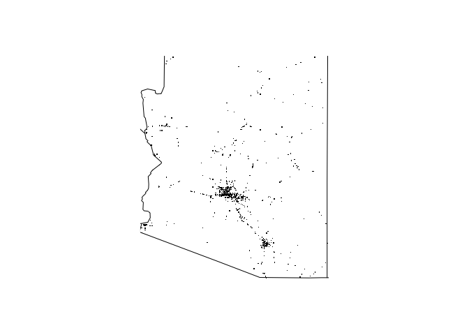
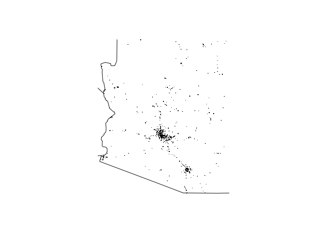
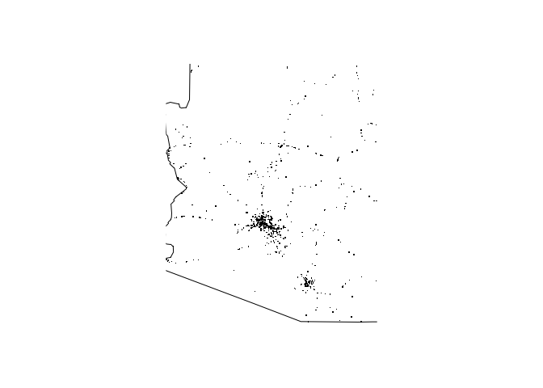

FarsPackage helps in reading Fatality Analysis Reporting System(FARS) data file and perform some analysis on it. You can easily include this package using following command:

``` r
library(farsPackage)
```

Once package is loaded, you can use following functions to summarize and visualize FARS data.

Loading data
------------

The function `system.file` is the key that will allow us to gain access to the 2013 to 2015 data within the package. Let's begin with the 2015 data.

``` r
### the following code reads access the accident_2015.csv.bz2 file in the folder extdata in package FARSread and save it as an R object named fars_2015
fars_2013 <- system.file("extdata", "accident_2013.csv.bz2", package = "farsPackage")
fars_2014 <- system.file("extdata", "accident_2014.csv.bz2", package = "farsPackage")
fars_2015 <- system.file("extdata", "accident_2015.csv.bz2", package = "farsPackage")

### copy the file from its folder and save it to the working directory
file.copy(from = fars_2013, to = getwd()) 
#> [1] TRUE
file.copy(from = fars_2014, to = getwd()) 
#> [1] TRUE
file.copy(from = fars_2015, to = getwd()) 
#> [1] TRUE
```

Summarizing years of data
-------------------------

You can use following R command to summarize any FARS file data

``` r
summarized_data <- fars_summarize_years(c(2013,2014,2015))
head(summarized_data)
#> # A tibble: 6 x 4
#>   MONTH `2013` `2014` `2015`
#>   <int>  <int>  <int>  <int>
#> 1     1   2230   2168   2368
#> 2     2   1952   1893   1968
#> 3     3   2356   2245   2385
#> 4     4   2300   2308   2430
#> 5     5   2532   2596   2847
#> 6     6   2692   2583   2765
```

This data represents the number of fatalities occurring in different months of provided years.

Visualizing Summarized Data
---------------------------

To Visualize fatalities data on the basis of different states, you can use following R command:

``` r
fars_map_state(state.num = 4, year=2013)
```



``` r
fars_map_state(state.num = 4, year=2014)
```



``` r
fars_map_state(state.num = 4, year=2015)
```



Deleting data from working directory
------------------------------------

Before we end, let's get read of the copy of the files we copied from the system directory to the working directory.

``` r
file.remove("./accident_2013.csv.bz2")
#> [1] TRUE
file.remove("./accident_2014.csv.bz2")
#> [1] TRUE
file.remove("./accident_2015.csv.bz2")
#> [1] TRUE
```
