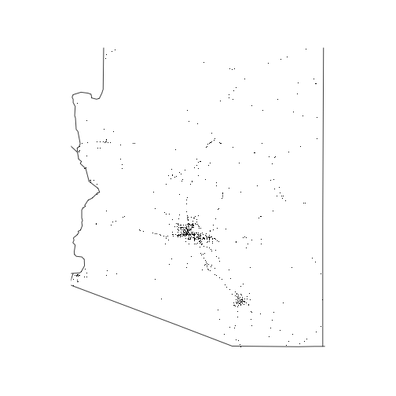

# farsPackage
Building R Packages - Week 4 Assignment

[](https://travis-ci.org/abhinavcreed13/testRPackage)

FarsPackage helps in reading Fatality Analysis Reporting System(FARS) data file and perform some analysis on it. 
You can easily include this package using following command:

```r
library(farsPackage)
```

Once package is loaded, you can use following functions to summarize and visualize FARS data.

## Summarizing years of data

You can use following R command to summarize any FARS file data


```r
summarized_data <- fars_summarize_years(c(2013,2014,2015))
head(summarized_data)
#> # A tibble: 6 x 4
#>   MONTH `2013` `2014` `2015`
#>   <int>  <int>  <int>  <int>
#> 1     1   2230   2168   2368
#> 2     2   1952   1893   1968
#> 3     3   2356   2245   2385
#> 4     4   2300   2308   2430
#> 5     5   2532   2596   2847
#> 6     6   2692   2583   2765
```
This data represents the number of fatalities occurring in different months of provided years.

## Visualizing Summarized Data

To Visualize fatalities data on the basis of different states, you can use following R command:


```r
fars_map_state(state.num = 4, year=2013)
```


